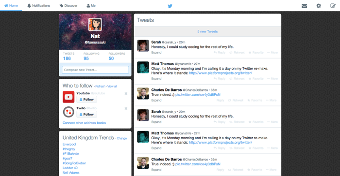

# Twitter Frontend Test

## Makers Academy Week 7 Test

This test was meant to prove our basic front-end skills. The task was to replicate Twitter's timeline page.

The task was set by [Evgeny Shadchnev](https://github.com/shadchnev).

### What could be still implemented
* some cool Javascript effects
* details in the timeline

## Technologies used
* HTML & CSS